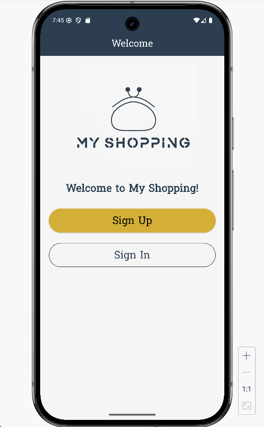
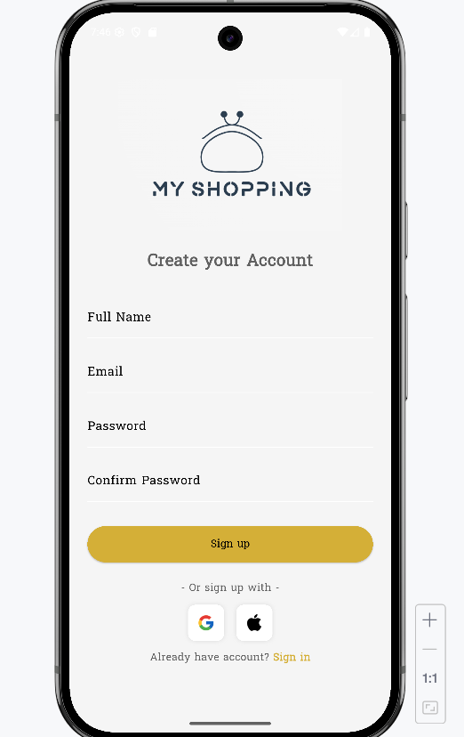
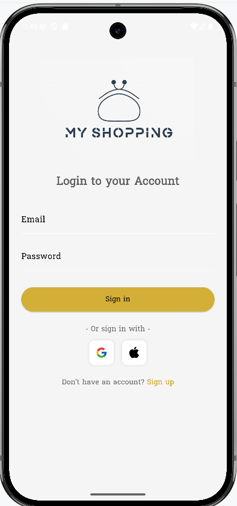
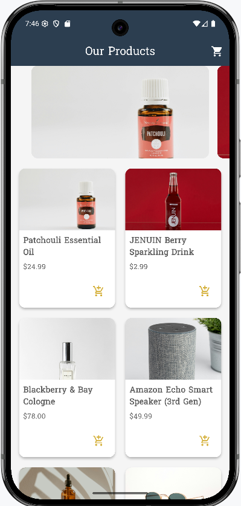
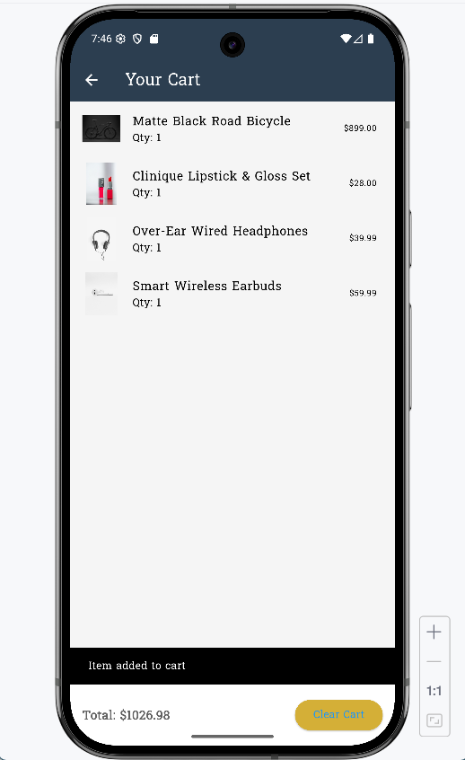

# Flutter Shopping App 🛍️

A clean, responsive, and localized shopping app built using Flutter with Provider state management, localization support, custom splash screen, and fully styled signup/login/cart flow.

---

## 📱 Screenshots

<div align="center">
  
  
  
  
  
  
</div>

---

## 🎬 Demo Video

[](https://www.youtube.com/watch?v=your_video_id_here)

---

## ✨ Features

- ✅ Beautiful sign-up & sign-in forms with validation
  - Full Name with capitalized first letter
  - Email validation (`@` required)
  - Password: min. 6 characters
  - Confirm Password matching
- ✅ Dialog confirmation on success
- ✅ Provider-based cart system with quantity tracking
- ✅ Fully responsive UI with Google Fonts and custom colors
- ✅ Localization-ready with `.arb` files "feature"
- ✅ Custom splash screen with centered icon
- ✅ App icon customization (Android 12+ support)
- ✅ Social login icons (Google, Apple)
- ✅ Modular folder structure

---

## 🔧 Technologies Used

- Flutter 3.8.1
- Dart
- Provider
- flutter_localizations + intl
- Lottie (optional)
- flutter_native_splash
- Google Fonts
- Material Design

---

## 🧱 Folder Structure

```
lib/
├── constants/           # Theme colors, styles
├── models/              # Product and cart item models
├── screens/
│   ├── auth/            # SignIn and SignUp screens
│   ├── home/            # Home screen and product grid
│   ├── cart/            # Cart page
├── services/            # Product service, Cart provider
├── main.dart            # App entry point
```

---

## 🎨 Branding

- **Primary Color:** `#2C3E50`
- **Accent (Gold):** `#D4AF37`
- **Text Color:** `#1A1A1A`
- **App Icon:** ``(resized and fixed for Android 12+)
- **Splash Image:** Centered and resized to `640x1280` from `splash.png`

---

## 📌 Notes on Customization

### ✔️ Changes made:

- 🔧 **Form validation** logic added (name uppercase, email `@`, password matching)
- 🎯 **Cart logic** via `CartService` with item quantity support
- 🎨 **Splash icon centered and background matched**
- 🧪 **SignIn/SignUp redirect logic fixed**
- 📸 Screenshots stored under `assets/screenshots/`

---

## 🚀 Getting Started

```bash
git clone https://github.com/yourname/flutter_shopping_app.git
cd flutter_shopping_app
flutter pub get
flutter run
```

To regenerate splash screen and icons:
```bash
flutter pub run flutter_native_splash:create
flutter pub run flutter_launcher_icons:main
```

---

## 🧾 License

This project is licensed under the MIT License - see the [LICENSE](LICENSE) file for details.

---

## 👤 Author

**Your Name**  
Feel free to reach out via [LinkedIn](https://linkedin.com/in/yourprofile) or open issues on GitHub.

---

## 📢 Contributing

Pull requests are welcome. For major changes, please open an issue first to discuss.

